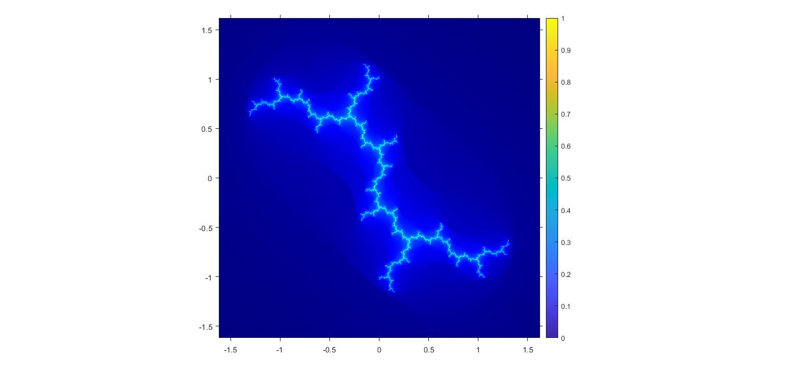
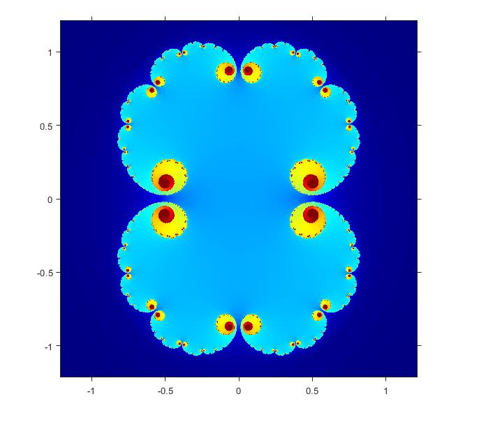

# Julia
Using cmaps in matlab to display Julia Sets in different Colors


## Installation
Use any licenced version of matlab after Version of 2016

## Usage
``` matlab 
function Image = showJulia(EscTime,EscVal,limits)
% SHOWJULIA Show a color image of a Julia set.
%
% function Image = showJulia(EscTime,EscVal,limits)
%
% Inputs:
%   EscTime = matrix of integer escape times
%   EscVal  = matrix of absolute z-values at escape times
%   limits  = vector of rectangular region limits, as in axis()
%
% Outputs:
%   Image = ny-by-nx-by-3 "truecolor" image array for use in imshow()
%
% See also IMSHOW.

[ny,nx] = size(EscTime);
x = linspace(limits(1),limits(2),nx);
y = linspace(limits(4),limits(3),ny);

% convert to real escape times for less color quantization
mask = isfinite(EscTime);
EscTime(mask) = EscTime(mask) - log(log2(EscVal(mask)));
E1 = EscTime(mask);

if isempty(E1)
    Image = zeros(ny,nx,3);
else
    ncolors = 2^20;
    cdf = [0 histcounts(E1,'BinMethod','integers','Normalization','cdf')];
    % restrict the cdf slope
    for k = 2:length(cdf)
        cdf(k) = min(cdf(k-1)+1e-2,cdf(k));  % avoid large color jumps
        cdf(k) = max(cdf(k-1)+1e-6,cdf(k));  % avoid color flatness
    end
    cdf = cdf/cdf(end);  % renormalize
    indices = [1+floor(cdf*(ncolors-2)) ncolors];
    cmap = jet(ncolors);
    cmap = interp1(linspace(1,ncolors,length(indices)),...
        cmap(indices,:),1:ncolors);
    cmap(ncolors,:) = 0;  % make top color black
    Emin = min(E1);
    if isempty(Emin)
        Emin = 0;
    end
    Emax = max(EscTime(mask));
    slope = (ncolors-2)/(Emax-Emin);
    val = round(1 + slope*(EscTime-Emin));
    val(~mask) = ncolors;  % makes interior points highest (black)
    Image = reshape(cmap(val,:),ny,nx,3);
end
imshow(Image,'XData',x,'YData',y);
set(gca,'YDir','normal');
axis on;

end
```




